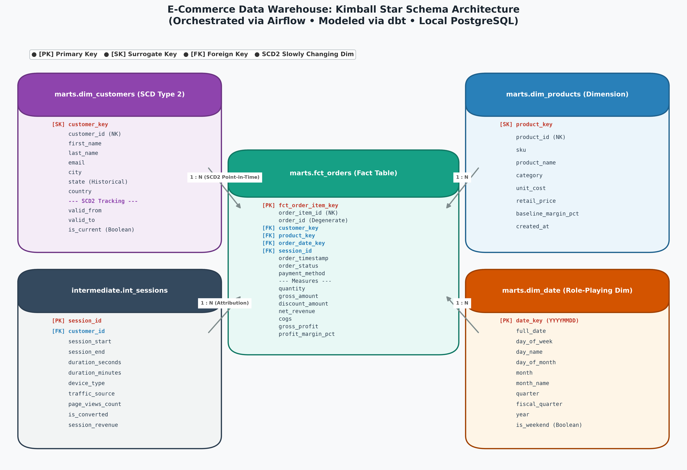

# Local ELT E-Commerce Data Warehouse (Microsoft SQL Server + dbt + Airflow + Metabase)

[](https://www.getdbt.com/)
[](https://www.microsoft.com/sql-server)
[](https://airflow.apache.org/)
[](https://powerbi.microsoft.com/)
[](https://www.postgresql.org/)
[](#dbt-transformation--testing-layer)

A production-grade, 100% free and open-source **ELT Data Warehouse** designed for enterprise analytics engineering portfolios. Built on **Microsoft SQL Server 2025** (with cross-database support for PostgreSQL 16), demonstrating an end-to-end modern data stack: raw bronze landing, JSON-based ELT ingestion, dbt transformations with **Kimball dimensional modeling** and **Slowly Changing Dimensions (SCD Type 2)**, 63 automated tests, Airflow DAG orchestration, and Power BI / Metabase reporting.

---

## Architecture Overview

```
[Python Synthetic Event Generator] (Faker, referential consistency)
                 │ (Raw JSON files)
                 ▼
[Bronze Landing Zone: Local / MinIO S3] (./data/bronze/)
                 │ (pymssql / pyodbc bulk batch ingestion)
                 ▼
[Microsoft SQL Server 2025: "raw" Schema] (NVARCHAR(MAX) JSON landing + DATETIME2 audit)
                 │
                 ▼
[dbt Core Transformations (dbt-sqlserver): Silver to Gold]
       ├── staging:      parse JSON with JSON_VALUE, enforce ANSI types, rename columns
       ├── intermediate: sessionize user journeys, calculate line margins & COGS
       └── marts:        Kimball Star Schema (dim_customers SCD2, dim_products, dim_date, fct_orders)
                 ▲
                 │ (Scheduled daily run + health monitoring + alerting)
[Apache Airflow Orchestration] (Webserver + Scheduler running in Docker)
                 │
                 ▼
[Power BI & Metabase Reporting Layer] (Direct connection to marts schema on Port 1433 / 3000)
```

---

## Kimball Star Schema & ER Diagram



### Schema Breakdown

| Entity | Schema Layer | Type | Grain | Primary / Natural Keys | Key Measures / Attributes |
|---|---|---|---|---|---|
| **`dim_customers`** | `marts` | SCD Type 2 | 1 row per customer version | `customer_key` (SK), `customer_id` (NK) | `state`, `country`, `valid_from`, `valid_to`, `is_current` (BIT) |
| **`dim_products`** | `marts` | Dimension | 1 row per catalog product | `product_key` (SK), `product_id` (NK) | `sku`, `category`, `unit_cost`, `retail_price`, `baseline_margin_pct` |
| **`dim_date`** | `marts` | Role-Playing | 1 row per calendar day | `date_key` (YYYYMMDD INT) | `full_date`, `day_of_week`, `fiscal_quarter`, `is_weekend` |
| **`fct_orders`** | `marts` | Transactional Fact | 1 row per order line item | `fct_order_item_key` (SK), `order_item_id` | `quantity`, `gross_amount`, `discount_amount`, `net_revenue`, `cogs`, `gross_profit` |
| **`int_sessions`** | `intermediate` | Analytical View | 1 row per web session | `session_id` | `traffic_source`, `device_type`, `duration_minutes`, `is_converted` |

---

## Architectural & Engineering Rationale

### 1. Why ELT over ETL?
- In traditional ETL, transformations occur in an intermediate compute engine before loading. In this modern **ELT** architecture, raw e-commerce payloads land directly into SQL Server `raw` schema as `NVARCHAR(MAX)` JSON documents with zero upfront loss of fidelity.
- All downstream transformations (casting, schema enforcement, SCD2 window calculations) are managed via **dbt Core**, utilizing SQL Server's native relational engine, tracking transformations in version-controlled SQL, and enabling idempotent replays.

### 2. Why Kimball Star Schema over 3NF or Snowflake?
- **Analytical Performance & Predictability:** Star schemas minimize table joins. Queries against `fct_orders` only require single-hop joins to `dim_customers`, `dim_products`, and `dim_date`.
- **BI Self-Service Usability:** Business users and BI tools (Power BI, Metabase, Tableau) easily navigate flat dimension attributes without deciphering complex normalized bridges.
- **Aggregations:** Additive facts (`net_revenue`, `quantity`, `gross_profit`) roll up cleanly across any dimension attribute (e.g., category, customer state, fiscal quarter).

### 3. Slowly Changing Dimension (SCD Type 2) Rationale
- When customers relocate between states (e.g. moving from New York to Texas), an SCD Type 1 model would overwrite the customer's state, improperly attributing prior historical revenue to the new jurisdiction.
- This warehouse implements **SCD Type 2** on `dim_customers` using surrogate keys (`customer_key`), timestamp validity boundaries (`valid_from`, `valid_to`), and an active status flag (`is_current`).
- `fct_orders` joins to `dim_customers` using point-in-time timestamp matching:
  ```sql
  LEFT JOIN dim_customers dc_exact
      ON m.customer_id = dc_exact.customer_id
      AND m.order_date >= dc_exact.valid_from
      AND (m.order_date < dc_exact.valid_to OR dc_exact.valid_to IS NULL)
  ```
  This guarantees historical reports accurately preserve customer geography at the exact time of order placement.

### 4. Cross-Engine Portability: Microsoft SQL Server + PostgreSQL
- Built using reusable Jinja macros:
  - `{{ json_extract('col', 'key') }}`: Generates `JSON_VALUE(col, '$.key')` on SQL Server and `col->>'key'` on PostgreSQL.
  - `{{ date_to_key('col') }}`: Generates `CONVERT(INT, CONVERT(VARCHAR(8), col, 112))` on SQL Server and `TO_CHAR(col, 'YYYYMMDD')::integer` on PostgreSQL.
- Both database engines run 100% of staging, intermediate, and marts models and pass the full **63-test automated test suite**.

---

## Repository Structure

```
ecommerce-elt-local/
├── docker-compose.yml           # Multi-service stack: MSSQL 2025, Postgres, Airflow, MinIO, Metabase
├── Dockerfile.airflow           # Airflow 2.9 image extended with dbt and ingestion drivers
├── .env.example                 # Environment configuration template
├── requirements.txt             # Python dependencies (dbt-sqlserver, dbt-postgres, pymssql, etc.)
├── ingestion/
│   ├── config.yaml              # Scale parameters, date ranges, database credentials
│   ├── generate_data.py         # Faker-based synthetic e-commerce data generator (SCD2 aware)
│   ├── load_to_bronze.py        # Lands raw JSON to ./data/bronze/ and MinIO bucket
│   ├── load_to_mssql.py         # Batch loads raw JSON into MSSQL 'raw' schema
│   └── load_to_postgres.py      # Batch loads raw JSON into Postgres 'raw' schema
├── dbt/
│   ├── dbt_project.yml          # Project configuration & schema routing
│   ├── packages.yml             # dbt_utils package dependency
│   ├── profiles.yml.example     # Connection profiles template (MSSQL & Postgres)
│   ├── macros/
│   │   ├── json_extract.sql     # Cross-engine JSON extraction macro (JSON_VALUE vs ->>)
│   │   ├── date_to_key.sql      # Cross-engine date-to-integer key macro
│   │   └── generate_schema_name.sql # Macro for custom schema generation
│   ├── models/
│   │   ├── sources.yml          # Raw landing source declarations
│   │   ├── staging/             # Silver layer: JSON parsing & ANSI type enforcement
│   │   │   ├── stg_customers.sql
│   │   │   ├── stg_products.sql
│   │   │   ├── stg_sessions.sql
│   │   │   ├── stg_orders.sql
│   │   │   ├── stg_order_items.sql
│   │   │   └── staging.yml
│   │   ├── intermediate/        # Silver-Gold bridge: business calculations
│   │   │   ├── int_sessions.sql
│   │   │   ├── int_order_margins.sql
│   │   │   └── intermediate.yml
│   │   └── marts/               # Gold layer: Kimball dimensional star schema
│   │       ├── dim_customers.sql # SCD Type 2 dimension
│   │       ├── dim_products.sql
│   │       ├── dim_date.sql     # Calendar spine (GENERATE_SERIES)
│   │       ├── fct_orders.sql   # Transactional fact table
│   │       └── marts.yml        # Schema & foreign key tests
│   └── tests/                   # Singular custom assertions
│       ├── assert_net_revenue_positive.sql
│       └── assert_scd2_date_validity.sql
├── airflow/
│   └── dags/
│       └── elt_pipeline_dag.py  # Orchestrates full end-to-end ELT schedule & alerts
├── docs/
│   ├── er_diagram.png           # Visual Kimball ER diagram
│   ├── generate_er_diagram.py   # Script to regenerate ER diagram
│   ├── data_dictionary.md       # Comprehensive table and field dictionary
│   └── project_walkthrough_and_linkedin_series.md # Architecture guide & 5-part LinkedIn series
└── README.md
```

---

## Quick Start Guide

### Prerequisites
- [Docker](https://docs.docker.com/engine/install/) (v24+)
- [Docker Compose](https://docs.docker.com/compose/) (v2.20+)
- Python 3.10+ (for host-level execution)

### 1. Launch Stack with Docker Compose
Clone the repository and run:
```bash
cp .env.example .env
docker compose up -d
```

This starts:
- **Microsoft SQL Server 2025**: Port `1433` (`sa` / `P@ssword#@219#`)
- **PostgreSQL 16**: Port `5432` (`warehouse` and `airflow` databases)
- **Airflow Webserver**: Port `8080` (UI: `admin` / `admin`)
- **Airflow Scheduler**: Background task coordinator
- **MinIO S3**: Port `9000` (API), Port `9001` (Console: `minioadmin` / `minioadmin`)
- **Metabase**: Port `3000` (Local BI dashboard)

### 2. Local Execution (MSSQL Pipeline)

```bash
# 1. Activate virtual environment and install dependencies
python3 -m venv .venv
source .venv/bin/activate
pip install -r requirements.txt

# 2. Generate synthetic e-commerce data & land in bronze zone
python -m ingestion.load_to_bronze

# 3. Load raw JSON into Microsoft SQL Server
python -m ingestion.load_to_mssql

# 4. Run dbt models and 63 automated tests against MSSQL
dbt run --project-dir dbt --profiles-dir dbt --target mssql
dbt test --project-dir dbt --profiles-dir dbt --target mssql
```

*(To run against PostgreSQL instead, simply use `python -m ingestion.load_to_postgres` and `--target postgres`).*

---

## dbt Transformation & Testing Layer

The project features a **63-test automated quality assurance suite** covering:
- **Uniqueness & Non-Null:** Validates primary keys and natural identifiers across all staging, intermediate, and marts tables.
- **Referential Integrity:** Enforces foreign key relationships from `fct_orders` to `dim_customers`, `dim_products`, and `dim_date`.
- **Custom Business Rules:**
  - `assert_net_revenue_positive`: Verifies line item revenue cannot be negative after discounts.
  - `assert_scd2_date_validity`: Validates that `valid_to > valid_from` for all historical customer records.

---

## Sample Analytical Queries for Power BI & SQL Exploration

Connect Power BI or Metabase to Microsoft SQL Server (`server: localhost,1433`, `database: warehouse`, `user: sa`, `password: P@ssword#@219#`).

### 1. Revenue & Gross Profit Margin by Product Category
```sql
SELECT
    p.category,
    COUNT(DISTINCT f.order_id) AS total_orders,
    SUM(f.quantity) AS units_sold,
    SUM(f.gross_amount) AS gross_sales,
    SUM(f.discount_amount) AS discounts,
    SUM(f.net_revenue) AS total_net_revenue,
    SUM(f.gross_profit) AS total_gross_profit,
    CAST(ROUND((SUM(f.gross_profit) / NULLIF(SUM(f.net_revenue), 0) * 100), 2) AS NUMERIC(10,2)) AS profit_margin_pct
FROM marts.fct_orders f
JOIN marts.dim_products p ON f.product_key = p.product_key
WHERE f.order_status = 'completed'
GROUP BY p.category
ORDER BY total_net_revenue DESC;
```

### 2. SCD Type 2 Historical Verification: Sales by Customer State at Order Time
```sql
SELECT TOP 10
    c.state AS customer_state_at_purchase,
    COUNT(DISTINCT f.order_id) AS order_count,
    SUM(f.net_revenue) AS total_revenue
FROM marts.fct_orders f
JOIN marts.dim_customers c ON f.customer_key = c.customer_key
GROUP BY c.state
ORDER BY total_revenue DESC;
```

### 3. Digital Marketing Conversion Attribution
```sql
SELECT
    s.traffic_source,
    s.device_type,
    COUNT(s.session_id) AS total_sessions,
    COUNT(s.converted_order_id) AS converted_sessions,
    CAST(ROUND((CAST(COUNT(s.converted_order_id) AS FLOAT) / NULLIF(COUNT(s.session_id), 0) * 100), 2) AS NUMERIC(10,2)) AS conversion_rate_pct,
    SUM(s.session_attributed_revenue) AS total_revenue
FROM intermediate.int_sessions s
GROUP BY s.traffic_source, s.device_type
ORDER BY total_revenue DESC;
```

---

## License & Author
Built for professional Data & Analytics Engineering portfolios under the MIT License.
